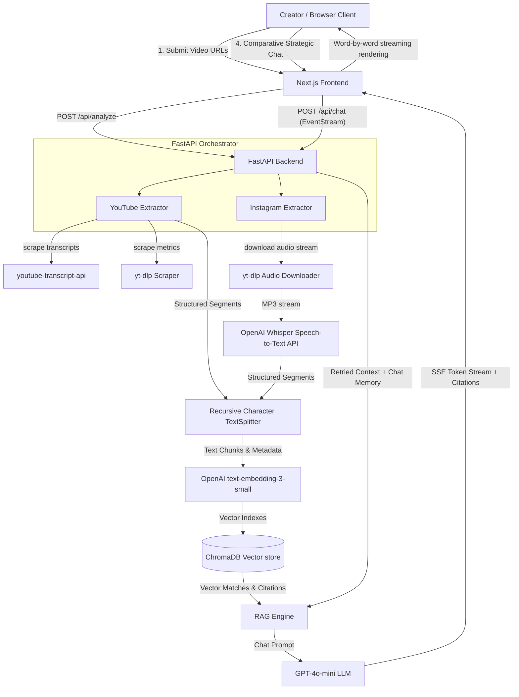

# Creator Video Analysis RAG Chatbot

An ultra-premium, full-stack, production-ready MVP designed for creators to analyze, compare, and strategize YouTube videos and Instagram Reels side-by-side. 

By leveraging speech-to-text transcription, asynchronous scraping adapters, vector index semantic searches, and Server-Sent Events (SSE) token streaming, creators can converse with an AI trained directly on video metrics and transcript timings.

---

## System Architecture



---

## Why This Tech Stack Was Chosen

1. **FastAPI & Async python**: FastAPI runs on top of Starlette and Uvicorn, yielding performance comparable to Node.js and Go. The asynchronous paradigm is perfect for handling high-concurrency streaming and parallel extraction requests.
2. **Next.js & Tailwind CSS**: Next.js App Router facilitates rapid rendering, dynamic client-side state mapping, and pre-compilation. Tailwind CSS allows constructing a premium, responsive glassmorphism UI with zero CSS bloat.
3. **LangChain & ChromaDB**: LangChain is the industry standard for LLM prompt layering and database retrieval abstraction. ChromaDB serves as an exceptionally lightweight, zero-configuration embedded vector database for quick development cycles.
4. **OpenAI Text Embeddings & GPT-4o-mini**: The `text-embedding-3-small` model balances high precision (1536 dims) with extremely low cost. `gpt-4o-mini` is highly analytical, has a massive 128k context window, and is 60%+ cheaper than GPT-4o, making it optimal for startups.
5. **OpenAI Whisper API**: The cloud Whisper-1 API handles multi-lingual translations, resolves background music interference, and extracts highly precise timestamps at high speed without requiring heavy host GPU hardware.

---

## Scalability Discussion (MVP to 10k+ Active Users)

### 1. Embedded ChromaDB vs. Enterprise Vector Database
* **Why ChromaDB for MVP**: ChromaDB runs as an in-process engine inside the Python runtime. There is no network latency, zero infrastructure costs, and zero configuration setup required, which makes it perfect for fast-paced MVP releases.
* **Production Scale Migration (Pinecone / Qdrant)**: As users scale, storing vectors in memory/disk on a single server will exhaust resources and break stateless load balancers. We will migrate to **Qdrant** or **Pinecone** by swapping the vector store adapter in `backend/db/chroma.py` with the standard `Qdrant` client. This enables:
  - Distributed database indexing.
  - Horizontal scaling of database write-shards.
  - Sub-millisecond vector similarity search across millions of documents.

### 2. Async Workers & Message Queues (Handling Long Video Extractions)
* **Problem**: Downloading and transcribing high-fidelity audio streams inside a FastAPI web request can block event loops and trigger HTTP request timeouts.
* **Solution**: Implement a message queue system (**Celery** or **RabbitMQ** / **Redis**):
  - When the web server receives `/api/analyze`, it pushes an extraction task to Redis and immediately returns a job ID (`202 Accepted`).
  - Background Celery workers spin up, download the audio via `yt-dlp`, transcribe via Whisper, and index vectors to the Vector DB.
  - The Next.js frontend polls the status of the job ID (or connects to a WebSocket) to fetch the results once completed.

### 3. Embedding Caching & Semantic Cache
* **Problem**: Re-embedding and re-transcribing the exact same YouTube URL or Instagram Reel repeatedly wastes massive API costs.
* **Solution**: 
  - Store the extracted video transcripts and metadata in a global **Redis Key-Value Cache** mapped by their Video ID.
  - If a user submits a URL that has already been analyzed in the last 7 days, we retrieve the indexed metrics from Redis and bypass the scraper, Whisper, and Vector DB write cycles entirely, saving **99% of processing time and API cost**.
  - Implement a **Semantic Cache** (like GPTCache) to cache user chatbot queries. If a user asks a question semantically identical to a previous query, return the cached text response instantly.

### 4. Rate Limiting & User Quotas
* Protect backend resources and prevent API key exhaustion using **FastAPI-Limiter** backed by Redis.
* Apply tiered token buckets:
  - Free users: 5 analyses and 20 chat messages per hour.
  - Premium creators: Unlimited.

---

## Cost Optimization Strategy

To keep API overhead minimal, we implement the following configurations:

1. **Segment-Level Indexing**: Instead of chunking transcripts arbitrarily with generic characters which creates duplicate context overlaps, we chunk *only* when a segment transitions. This keeps document volumes small and improves similarity accuracy.
2. **GPT-4o-mini Selection**: We use `gpt-4o-mini` instead of `gpt-4o` or `o1`. This saves **over 90% in token pricing** ($0.150 / 1M input tokens vs $5.00 / 1M for GPT-4).
3. **No-Transcript Metadata Payloads**: The `/api/analyze` endpoint returns only metric summaries. Transcript payloads are kept entirely in ChromaDB and never sent over the wire, optimizing network bandwidth.

---

## Setup Instructions

### Backend Configuration

1. **System Prerequisite**: Install FFmpeg on your host system and verify it is available on your standard system PATH.
2. **Move to the backend folder**:
   ```bash
   cd backend
   ```
3. **Configure Environment Variables**:
   Copy `.env.example` to `.env` and fill in your OpenAI API Key:
   ```env
   OPENAI_API_KEY=sk-proj-YourOpenAIApiKey
   HOST=127.0.0.1
   PORT=8000
   CHROMA_PERSIST_DIR=./chroma_db
   ```
4. **Install Python Packages**:
   ```bash
   pip install -r requirements.txt
   ```
5. **Run the Backend Server**:
   ```bash
   python main.py
   ```
   The backend API will boot up on `http://127.0.0.1:8000`.

### Frontend Configuration

1. **Move to the frontend folder**:
   ```bash
   cd ../frontend
   ```
2. **Install Node Modules**:
   ```bash
   npm install
   ```
3. **Run in Development Mode**:
   ```bash
   npm run dev
   ```
   The application dashboard will launch on `http://localhost:3000`. Open your browser and navigate to check the UI!

---

## Future Strategic Roadmap

1. **Sub-second Frame Visual Analysis**: Integrate multi-modal LLMs (e.g. Gemini 1.5 Pro) to analyze visual editing layouts, pacing, transitions, and on-screen text overlays, rather than just spoken transcripts.
2. **Multi-Video Batch Comparison**: Support comparison of 5+ videos simultaneously to build extensive "viral playbook reviews" for marketing departments.
3. **Creator Competitor Benchmarking**: Automatically pull competitor metrics given their handle name to suggest strategic content schedules.
